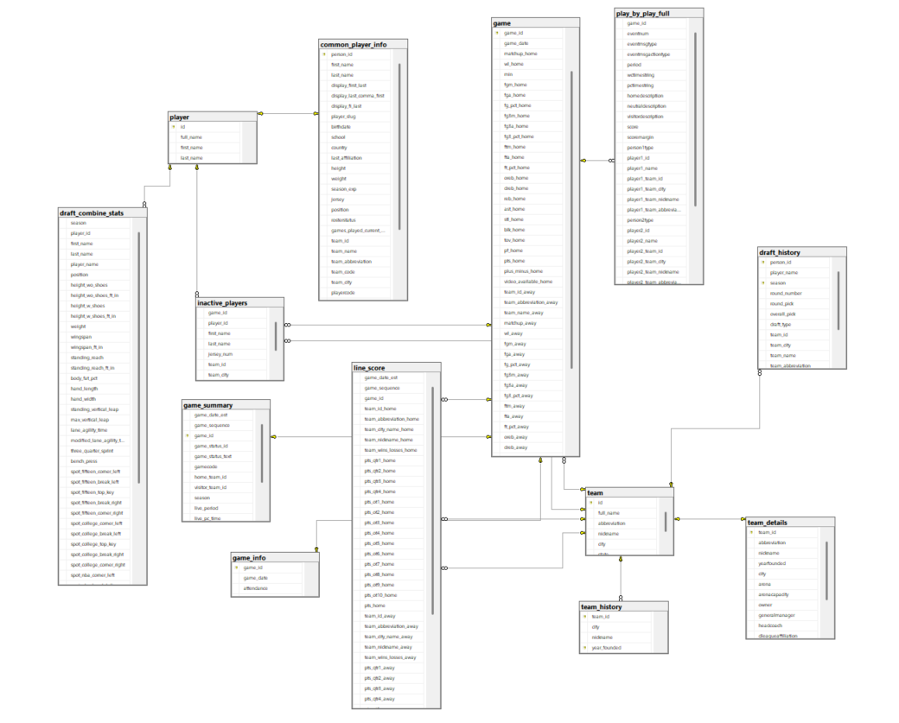
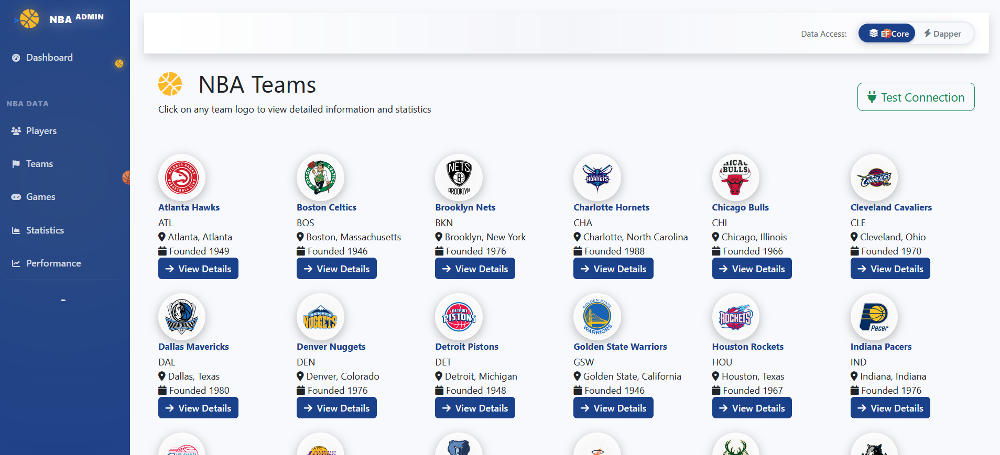
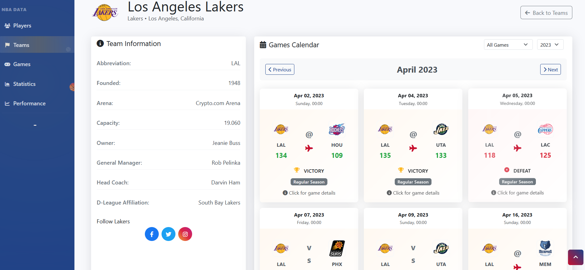
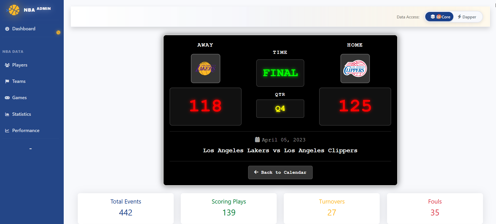
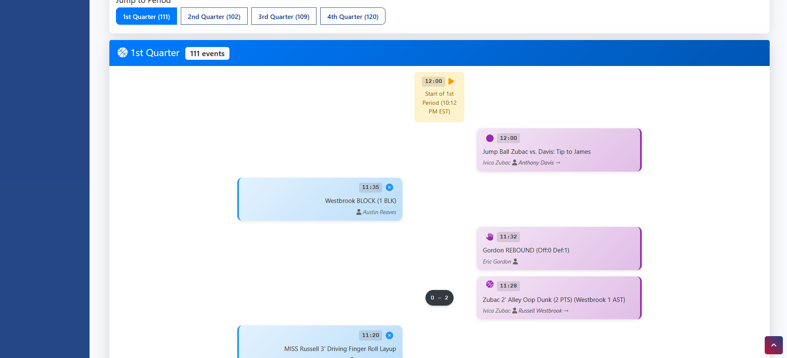
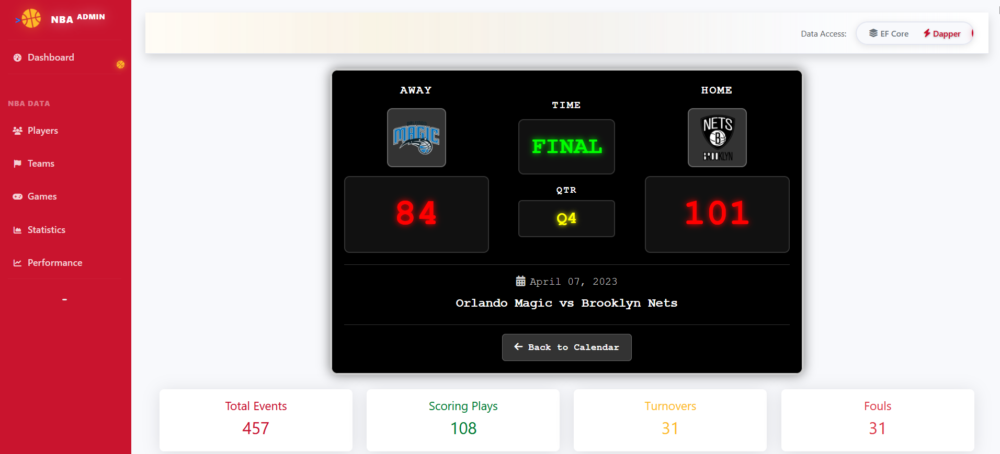
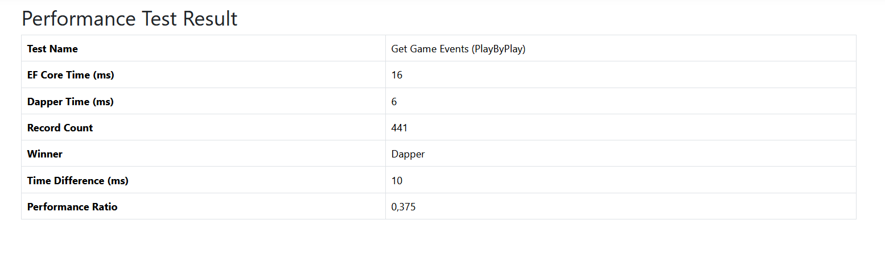

  
   
  <h1>🏀 NBA Maç Analiz Sistemi: Büyük Veride Performans Kıyaslaması 🚀</h1>
  
Veritabanı Optimizasyonu ve Veri Erişim Teknolojileri ile Derinlemesine NBA Maç Analizi

---

Bu proje, **ASP.NET Core (kullanılan versiyon: .NET 9)** ile geliştirilmiş, kapsamlı bir NBA veri tabanı üzerinde maçları ve oyuncu istatistiklerini detaylı bir şekilde analiz eden bir uygulamadır. Özellikle **Maçkolik** benzeri bir kullanıcı deneyimi sunarak, kullanıcıların seçilen bir takımın, seçilen maçındaki önemli anları (`play_by_play` verileri) görselleştirmesini ve incelemesini hedefler. Proje aynı zamanda, hem **veri tabanı optimizasyonlarını** hem de **farklı veri erişim teknolojilerinin (EF Core ve Dapper) performanslarını** karşılaştırmalı olarak değerlendirme fırsatı sunmaktadır.

---

## 📊 Veritabanı Detayları

Proje, gerçek NBA maç verilerini içeren geniş bir veri tabanını kullanmaktadır:

-   **Toplam Tablo Sayısı:** 13 tablo
-   **Ana Veri Tablosu:** `play_by_play`
    * Bu tablo, maçların top-topa (play-by-play) anlarını içerir ve yaklaşık **13 milyon satır veri** ile projenin büyük veri işleme kapasitesini test etmek için önemli bir kaynaktır.

### Veritabanı Şeması

Aşağıdaki diyagramda kullanılan veritabanı tablolarının ilişkisel yapısını görebilirsiniz:

---

## 🚀 Temel Özellikler ve Performans Optimizasyonları

-   **Maç Detayları ve Önemli Anlar:** Kullanıcıların seçtiği bir takımın, seçtiği maçındaki `play_by_play` tablosundan çekilen verilerle, maçın önemli anları (sayılar, fauller, top kayıpları vb.) **Maçkolik uygulamasına benzer bir akışla** anlık olarak sunulur. Bu özellik, kullanıcıların maç gidişatını saniyeler içinde takip etmesini sağlar.
-   **Veritabanı İndeksleme:** Özellikle **13 milyon satırlık `play_by_play`** gibi büyük tablolar üzerinde yapılan sorguların performansını artırmak amacıyla veritabanında **kapsamlı indeksleme stratejileri** uygulanmıştır. Bu indeksler, veri çekme işlemlerinin hızını dramatik şekilde iyileştirir ve uygulamanın genel yanıt süresini optimize eder.
-   **Performans Kıyaslaması (EF Core vs. Dapper):** Uygulama, aynı veri çekme işlemlerini gerçekleştirmek için hem **Entity Framework Core (EF Core)** hem de **Dapper** kütüphanelerini kullanır. Bu sayede, iki farklı veri erişim teknolojisinin büyük veri kümeleri üzerindeki **performansları karşılaştırılmakta** ve elde edilen sonuçlar analiz edilmektedir. Bu kıyaslama, uygulamanın farklı senaryoları için hangi veri erişim teknolojisinin daha uygun olduğuna dair bilinçli kararlar verilmesine olanak tanır.
-   **Kullanıcı Dostu Arayüz:** Kullanıcıların takımları ve maçları kolayca seçip `play_by_play` verilerine erişebilmesi için basit ve anlaşılır bir arayüz sunulmuştur.
-   **Asenkron Veri İşlemleri:** Uygulama, performanslı ve duyarlı bir kullanıcı deneyimi sunmak için asenkron programlama (`Async/Await`) prensiplerini etkin bir şekilde kullanır.

---

## 💻 Kullanılan Teknolojiler

-   **Backend:**
    -   ASP.NET Core (kullanılan versiyon: **.NET 9**) 🌐
    -   C# 🚀
    -   **Entity Framework Core (DB First)** (Veritabanı ORM) 📊
    -   **Dapper** (Mikro-ORM, Ham SQL ile performans odaklı veri erişimi) ⚡
    -   LINQ, Async/Await (Veri sorgulama ve asenkron programlama) ✨
-   **Frontend:**
    -   HTML5, CSS3, JavaScript 💻
    -   Bootstrap (Duyarlı ve modern tasarım) 🎨
    -   jQuery (AJAX işlemleri ve DOM manipülasyonu) 📄
-   **Veritabanı:**
    -   **SQL Server** 💾 (Yaklaşık 13 milyon satırlık `play_by_play` tablosu dahil 13 tablo ile büyük veri yönetimi)

---

## 📸 Uygulama Görselleri

### Takım ve Maç Seçim Ekranları

### Maç Detayları ve Anlatım Akışı

### Örnek Bir Maç Akışı

---

## 📈 Performans Testi Sonuçları

EF Core ve Dapper ile yapılan aynı sorguların performans karşılaştırmasını gösteren görsel aşağıdadır:

---
